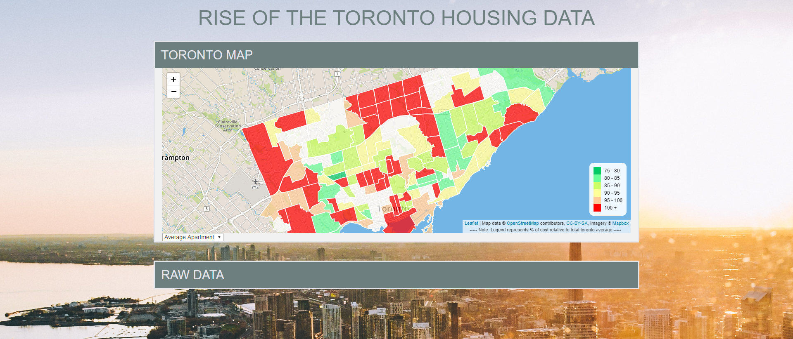
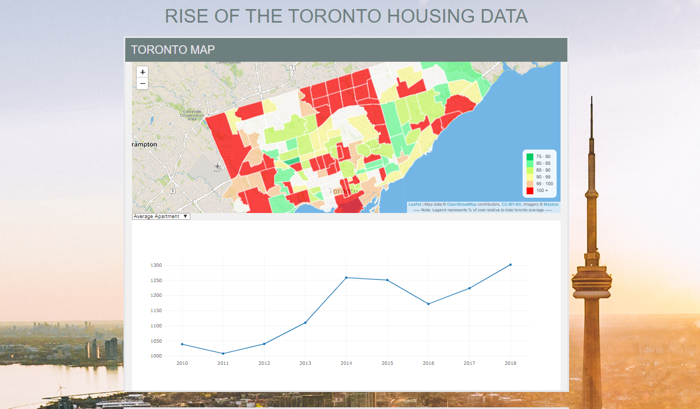

# TORONTO-HOUSING-COST
A VISUALIZATION OF RENTAL PRICES IN THE CITY OF TORONTO FROM 2010 TO 2018.
An interactive dashboard showing a geographical map of neighbourhoods in the City of Toronto and Infographic bar charts presenting historical rental prices.

Find final project by clicking the link below:
https://kanbhatia.github.io/TORONTO-HOUSING-COST/

The picture obove shows the selection process. Once you have clicked on a neighbourhood, the map zooms in and shows a plot of yearly housing prices. You can then select the drop down menu to select specific type of housing you would like to analyze.  

This project features a Python Flask–powered RESTful API, HTML/CSS, JavaScript and SQL database. 
